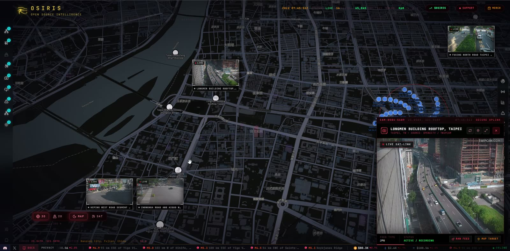
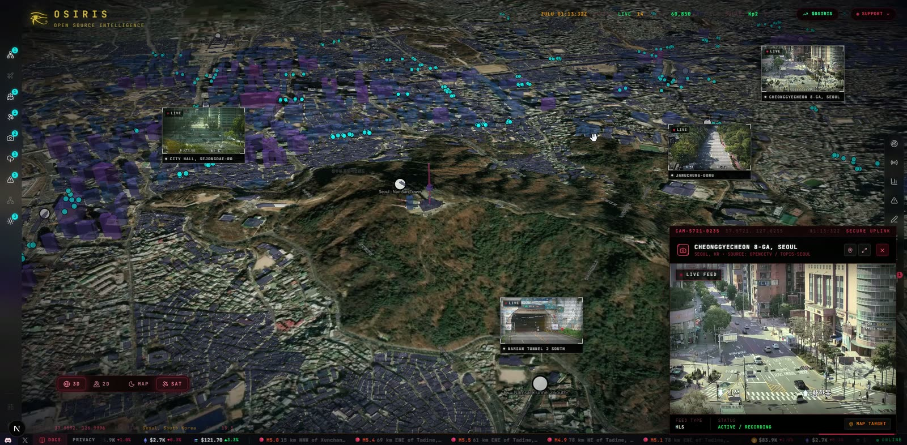
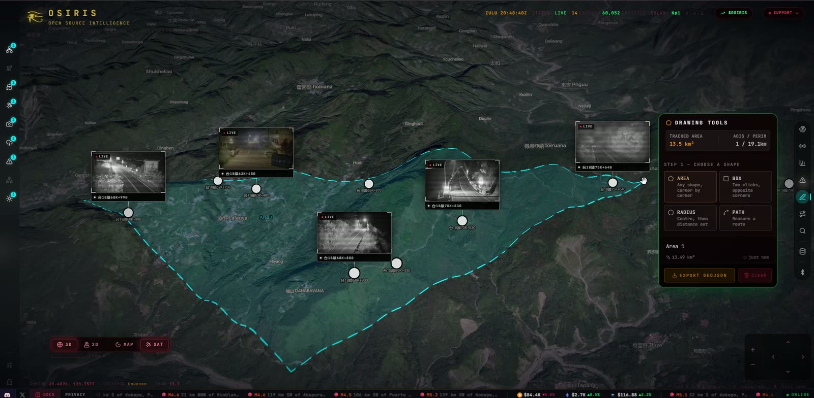

<div align="center">

# ⬡ OSIRIS

### Open Source Intelligence & Reconnaissance Integrated System

[](https://osirislive.app)
[](https://www.patreon.com/posts/159077425)
[](https://nextjs.org)
[](https://typescriptlang.org)
[](https://maplibre.org)
[](LICENSE)

**A real-time global intelligence dashboard that aggregates live flight tracking, CCTV networks, earthquake monitoring, conflict zone mapping, and 24/7 news feeds into a single GPU-accelerated interface.**

[Live Demo](https://osirisai.live) · [Report Bug](https://github.com/simplifaisoul/osiris/issues) · [Request Feature](https://github.com/simplifaisoul/osiris/issues) · [Join Discord](https://discord.gg/umBykEpb98)

</div>

---

## Screenshots

<p align="center">
  
  <br><sub><b>Taiwan</b> — Taipei's public traffic cameras streaming live on the Night map, one feed open full-size</sub>
</p>

<p align="center">
  
  <br><sub><b>Seoul</b> — live CCTV in 3D terrain around Namsan Tower, with the Cheonggyecheon feed playing</sub>
</p>

<p align="center">
  
  <br><sub><b>Save an Area</b> — draw a region and OSIRIS finds every camera inside it, ready to export as GeoJSON</sub>
</p>

---

## Overview

Osiris is a production-grade OSINT platform that provides situational awareness across multiple intelligence domains. Built with Next.js 16 and MapLibre GL, every data point is rendered via WebGL for 60fps performance even with thousands of concurrent entities on-screen.

### Key Capabilities

| Domain | Data Points | Sources |
|--------|------------|---------|
| **Aviation** | Commercial, Private, Military, Jets | OpenSky Network |
| **Maritime** | 39 Global Ports, 10 Chokepoints | Static Naval Intel |
| **CCTV** | 17,000+ Cameras | TfL, WSDOT, Caltrans, ODOT, MDOT, HK Transport Dept, Taiwan THB, NZTA, Rijkswaterstaat, [Public Webcams](#acknowledgements) + more |
| **Seismic** | Real-time M2.5+ | USGS Earthquake API |
| **Fires** | Active Hotspots | NASA FIRMS |
| **News** | 24/7 Live Streams | 23 Global Broadcasters |
| **Weather** | Severe Events | NASA EONET |
| **Space** | Solar Weather, Satellites | NOAA SWPC, N2YO |
| **Cyber** | CVE Threats, Vulnerability Scanning | NVD, Custom Scanner |
| **Conflict** | 13 Active Zones | Static OSINT Intel |
| **Crypto** | BTC + ETH Wallet Tracing, OFAC SDN Match | blockstream.info, Blockscout, OpenSanctions |
| **Sanctions** | Person / Org / Vessel SDN Search | OpenSanctions (US OFAC SDN mirror) |
| **Telegram OSINT** | Geoparsed Posts from Public Channels | `t.me/s/<channel>` web preview |

---

## Architecture

```
┌─────────────────────────────────────────────────┐
│                  OSIRIS CLIENT                   │
│  ┌──────────┐  ┌──────────┐  ┌───────────────┐ │
│  │ MapLibre  │  │  HUD     │  │  RECON Toolkit│ │
│  │  GL (GPU) │  │ Panels   │  │  Port Scan    │ │
│  │  WebGL    │  │ Layers   │  │  DNS / WHOIS  │ │
│  │  Render   │  │ Controls │  │  Vuln Scanner │ │
│  └──────────┘  └──────────┘  └───────────────┘ │
├─────────────────────────────────────────────────┤
│               NEXT.JS API ROUTES                 │
│  /api/flights         /api/earthquakes          │
│  /api/cctv            /api/news                 │
│  /api/fires           /api/maritime             │
│  /api/gdelt           /api/satellites           │
│  /api/weather         /api/scanner              │
│  /api/sentinel        /api/telegram-feed        │
│  /api/osint/*  (whois, dns, ip, cve, sanctions, │
│                 crypto, sweep, threats, …)      │
├─────────────────────────────────────────────────┤
│              EXTERNAL DATA SOURCES               │
│  OpenSky · USGS · NASA · NOAA · TfL · NVD      │
│  GDACS · EONET · FIRMS · N2YO · RSS Feeds      │
│  blockstream.info · Blockscout · OpenSanctions  │
│  t.me public previews                            │
└─────────────────────────────────────────────────┘
```

---

## Features

### Intelligence Layers
- **16 toggleable data layers** with real-time entity counts
- **GPU-accelerated rendering** — all map data rendered via WebGL, not DOM
- **Progressive loading** — data fetched on-demand when layers are activated
- **Viewport-aware** — only loads relevant data for the visible region

### OI — a prediction engine (bring your own key)
**OI Assist**: talk to the map (press O). Ask in words, typed or spoken, and OI flies you there, switches the layers on, finds what is live (flights, military aircraft, ships, quakes, fires, weather, news, cameras, satellites), marks it on the globe in cyan with the area it searched, lists it in cards you can click through, reads the markets, opens panels and starts forecasts, all on your own model key.

**OI Forecast**: a prediction engine, not a poll of opinions. The ask form suggests what the world is betting on (the busiest open questions on Polymarket, with the crowd's price) so a prediction can be run against the crowd in a click. Ask a question and OI researches it from sources that can be checked: the reporting (a newsroom of publishers' own feeds by desk, from wire services and national newsrooms to specialist desks for markets, crypto, energy, defense, tech and health, plus Yahoo Finance's newswire for any ticker in play, GDELT and Wikipedia's Current events, each story with its link and the article's own text where the publisher serves it; social networks are left out), two years of daily prices for any market price the question turns on, what prediction markets (Polymarket, Manifold) price the same question at, Wikipedia background, and the live OSIRIS feeds where they are on topic (a Telegram post stays labelled as a social-media post). It maps the world that decides it, and casts the actors who shape the outcome (governments, leaders, companies, markets, groups), each with what it wants, the levers it can pull, its red lines and how it decides. Only actors that can act are cast: a market or a price is the world they move, never one of the players. Then it plays them against each other over simulated time: dated periods from today to the question's horizon, in several parallel worlds. In every period each actor decides its move from what has happened in its world so far, quoting the sources behind it, and a world engine turns the moves into what actually happens: dated events, the occasional surprise, and where the question now stands. A world where the question settles early stops there. On a question about a price (will SOL reach $200, where will Brent settle), the price is priced: the instrument's own daily moves, with their average trend taken out, are resampled into thousands of paths to the horizon, which give the statistical baseline; each world gets its own course for the price, spread across what can happen; the period's events push it; and the price, not a model's judgment, settles the question. The worlds' events are then run through the market's own paths, so a handful of worlds reads as a probability. A report agent weighs the prediction against what can be checked (the prediction market on the same question, the statistical baseline, the simulation priced) and shows them side by side, each a click from its source; when the market prices the question as a ladder of levels, the whole ladder is set beside OI's own curve, rung by rung, and the baseline shows its record on the instrument's own past (forecasts from the year before each day, scored against what happened). Then it writes the prediction: how it most likely unfolds, date by date, what each actor does, how each world ended, and a calibrated figure in the shape the question asks for (a probability for yes or no, a share for each outcome, or an estimate with a range), with drivers, scenarios, signposts and dissent. It all draws itself on the globe as it runs: actors where they act, events where they happen, every move an arc through the sky. Click any arc or point to open that piece of the research; the camera follows the run until you take it. Every quote is checked against its source, marked verbatim or paraphrase and linked to where it was published; in the research graph each one is a thread from the actor to its source, and the report's drivers name the sources they rest on, so any conclusion can be followed back to its words. Inject an event mid-run (it happens in every world), question any actor or the report agent after, share the run by link. Violet arcs mark alignment and cooperation, magenta rivalry and pressure, indigo everything between; all three can be changed in the Style Studio. Full screen opens a workspace: the prediction and an execution trace of every step the engine took; the globe, a MiroFish-style research graph, a timeline of the worlds period by period and sortable tables of actors, moves, events, sources and links; an object view for whatever is selected; and a search across the run (Ctrl+K).
- **Your own data**: add files (CSV, JSON, Markdown, text, logs, web pages) or paste up to 100,000 characters. The world model reads it once; or have every actor read it in every period, and quote it. The extra input tokens are shown before you run, on your own key.
- **Your own key**: OpenAI, Anthropic, Google Gemini, OpenRouter, Groq, DeepSeek, xAI, Mistral or Qwen. Kept in your browser, sent per request in a header, never stored on the server.
- **REST API** under `/api/oi` with live Server-Sent Events, and an **MCP server** at `/api/mcp` so agents such as Hermes, Claude and Cursor can run predictions, steer them and read OSIRIS intelligence. See [the docs](https://osirisai.live/docs#oi).

### Texas CCTV
Public TxDOT ITS snapshots are integrated with the existing camera markers, preview grid and viewer. Use `/api/cctv?region=texas` for Texas only; global and Texas location queries include the same source. District inventories are cached independently, with stale data retained during outages. Availability varies by district and camera; these are refreshing JPEG snapshots, not video streams.

Source: [TxDOT ITS](https://its.txdot.gov/its/District/DAL/cameras).

Run `npm test` for offline checks or `RUN_LIVE_TESTS=1 npx vitest run src/app/api/cctv/texas.test.ts` to check the public Texas inventory.

### RECON Toolkit
- **Port Scanner** — TCP connect scan with service fingerprinting
- **DNS Lookup** — Full record resolution (A, AAAA, MX, NS, TXT, CNAME)
- **WHOIS** — Domain/IP registration data (auto-cross-checked against OFAC SDN)
- **SSL/TLS Inspector** — Certificate chain analysis
- **IP Intelligence** — Geolocation, ASN, threat reputation (auto-cross-checked against OFAC SDN)
- **Vulnerability Scanner** — CVE lookup against NVD database
- **Crypto Wallet Trace** — BTC + ETH lookup (balance, tx history, OFAC SDN sanctions flag)
- **OFAC Sanctions Search** — query persons, organizations, vessels and aircraft against the US OFAC SDN list

### Live Broadcast Network
- **23 live 24/7 news streams** from global broadcasters
- Click any news dot on the map to open the live stream
- Feeds from NBC, CBS, ABC, Sky News, Al Jazeera, France 24, NHK, WION, and more

### Telegram OSINT Layer
- **Public-channel feed** scraped from the unauthenticated `t.me/s/<channel>` web preview — no Bot API token, no MTProto
- Default curated set of 5 channels (EN + RU/UA war reporting), overridable via `OSIRIS_TELEGRAM_CHANNELS`
- Posts are geoparsed against a multilingual place dictionary (EN + Cyrillic + Arabic) and plotted on the map
- Click any cyan dot to read the post and jump to the original on Telegram

### Crypto Wallet Intelligence
- **BTC** lookups via [blockstream.info](https://blockstream.info) (Esplora API, keyless)
- **ETH** lookups via [Blockscout](https://github.com/blockscout/blockscout)'s public ETH instance (`eth.blockscout.com`, keyless)
- Every lookup is cross-checked against the OFAC SDN sanctioned-address list (mirrored from [`0xB10C/ofac-sanctioned-digital-currency-addresses`](https://github.com/0xB10C/ofac-sanctioned-digital-currency-addresses))
- Sanctioned wallets surface a red **SANCTIONED — OFAC SDN** badge in the RECON panel

### OFAC SDN Cross-Check
- Standalone `SANCTIONS` tab in the RECON toolkit — full-text search across persons, organisations, vessels and aircraft
- WHOIS and IP-intel routes auto-cross-check registrant / ASN-owner names against the SDN list and surface an inline alert
- Data sourced from [OpenSanctions](https://www.opensanctions.org) (CC-BY 4.0) — keyless, ~7 MB cached in-memory for 24h

### Conflict Zone Monitoring
- **13 active conflict/tension zones** with severity-coded warning markers
- Active Wars: Ukraine, Gaza, Sudan, Myanmar, DRC, Yemen
- High Tension: Syria, Lebanon, Sahel, Somalia, Red Sea
- Elevated: Taiwan Strait, Korean DMZ

### Performance Optimized
- **75% reduction in edge requests** vs initial release
- Aggressive polling relaxation (15-30 min intervals for stable data)
- Static data served from memory (zero external API calls for news feeds)
- `layerFetchedRef` prevents duplicate API requests

---

## Quick Start

```bash
git clone https://github.com/simplifaisoul/osiris.git
cd osiris
npm install
npm run dev
```

Open [http://localhost:3000](http://localhost:3000)

### Docker / Self-Hosting

```bash
git clone https://github.com/simplifaisoul/osiris.git
cd osiris
cp .env.template .env     # optional — configure keys / port
docker compose up -d
```

Open [http://localhost:3000](http://localhost:3000). The image is a multi-stage
`node:22-alpine` standalone build (~220 MB, non-root). The compose file also
carries CasaOS app metadata (`x-casaos:`) for one-click install on
[CasaOS](https://casaos.io). See **[DOCKER.md](DOCKER.md)** for the full Docker,
CasaOS and API-key guide.

**Prebuilt image (GHCR)** — skip the build and pull it directly:

```bash
docker pull ghcr.io/simplifaisoul/osiris:latest
docker run -d -p 3000:3000 --env-file .env ghcr.io/simplifaisoul/osiris:latest
```

**Custom port** — the container always listens on `3000`; set `OSIRIS_PORT` in
`.env` to change the published host port (e.g. `OSIRIS_PORT=3005`) without
editing the compose file.

### Environment Variables

OSIRIS works **partially without any API keys** — all core feeds use public,
keyless sources. Copy [`.env.template`](.env.template) to `.env` and set only
what you need:

```env
# Published host port (container always listens on 3000). Default: 3000
OSIRIS_PORT=3000

# RECON scanner backend (the only vars the current code reads).
# SCANNER_KEY must match the backend's OSIRIS_KEY — generate with: openssl rand -hex 32
SCANNER_URL=
SCANNER_KEY=

# Optional, for higher rate limits / future sources (see DOCKER.md for signup links)
FIRMS_API_KEY=                # NASA FIRMS  — firms.modaps.eosdis.nasa.gov/api/map_key/
OPENSKY_CLIENT_ID=            # OpenSky OAuth2 (since Mar 2025) — opensky-network.org
OPENSKY_CLIENT_SECRET=
N2YO_API_KEY=                 # N2YO satellites — n2yo.com (Profile → API key)
AIS_API_KEY=                 # aisstream.io maritime
```

> Without `SCANNER_URL`/`SCANNER_KEY` the RECON toolkit returns `503`; every
> other layer works out of the box. `.env` is gitignored — only the template is committed.

---

## Tech Stack

| Layer | Technology |
|-------|-----------|
| Framework | Next.js 16 (App Router, Turbopack) |
| Language | TypeScript 5 |
| Map Engine | MapLibre GL JS (WebGL) |
| Animations | Framer Motion |
| Icons | Lucide React |
| Styling | Custom CSS Design System |
| Deployment | Vercel Edge Network |

---

## Keyboard Shortcuts

| Key | Action |
|-----|--------|
| `F` | Toggle flight layers |
| `E` | Toggle earthquakes |
| `S` | Toggle satellites |
| `D` | Toggle day/night cycle |
| `Escape` | Close panels |

---

## Acknowledgements

**Public webcams** — the cameras in this layer are open data: each one is broadcast
publicly by whoever runs it, on their own site or their own channel. What the web
lacked was a catalogue of them.

[bekijkhet.nu](https://www.bekijkhet.nu/) is that catalogue, and it is the basis for
every camera in the layer. Bram and Annelies have kept it by hand since 2012, and
without their index these cameras would still be scattered across several hundred
unrelated sites with no way to find them.

OSIRIS links every one of them straight through to the operator who runs it, which is
also how bekijkhet.nu asks to be read.

**OI** — the method behind OI follows [MiroFish](https://github.com/666ghj/MiroFish),
the open-source swarm-intelligence prediction engine: seed a parallel world from real
material, populate it with agents, let them interact while variables are injected, and
hand the simulation to a report agent. OSIRIS rebuilds that method natively for its own
feeds and globe; no MiroFish code is used.

---

## License

MIT — see [LICENSE](LICENSE) for details.

---

<div align="center">

**🛠️ SUPPORT THE OSIRIS PROJECT**
The OSIRIS Global Intelligence Grid is entirely open-source, but running the backend scanners and data firehoses isn't cheap.

If you want to help keep the servers alive, and support us to get access to better tools  unlock the **Special OSIRIS Console**, Currently Just a Cool UI. a you can officially support the project here : 

🔗 [Support OSIRIS on Patreon](https://www.patreon.com/posts/159077425)

*Supporters receive the `🔴 RedTeam Console` role and access to encrypted developer comms.*


**Built by [simplifaisoul](https://github.com/simplifaisoul)**

[Join our Discord to be a part of this movement!](https://discord.gg/umBykEpb98)

</div>
